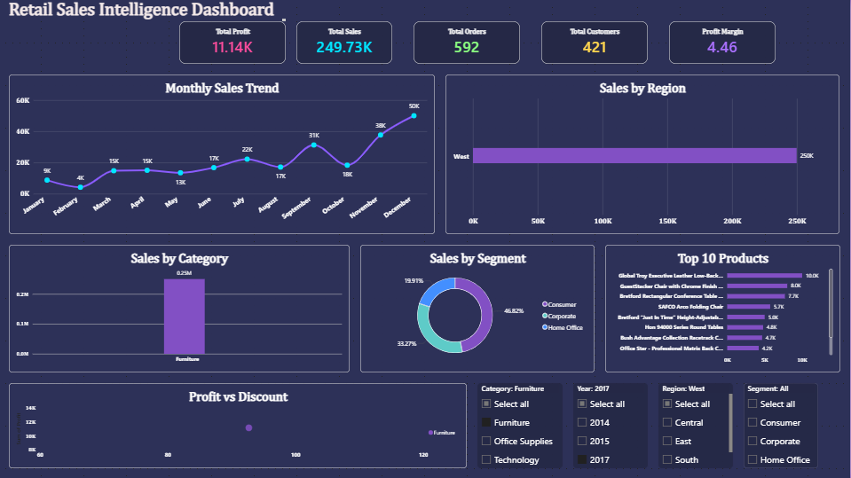

# Retail Sales Intelligence Platform

An end-to-end Data Analytics project built using **Python**, **Oracle SQL**, and **Power BI** to analyze retail sales data and generate actionable business insights through an interactive dashboard.

---

## Project Overview

The **Retail Sales Intelligence Platform** focuses on transforming raw retail sales data into meaningful business insights. The project demonstrates the complete analytics workflow—from data cleaning and preprocessing to SQL-based analysis and interactive dashboard creation.

This project answers key business questions such as:

- Which region generates the highest sales?
- Which product category is the most profitable?
- How do discounts impact profit?
- Which customer segment contributes the most revenue?
- What are the monthly sales trends?

---

## Tools & Technologies

- Python
- Pandas
- NumPy
- Oracle SQL
- Power BI
- VS Code
- Git
- GitHub

---

## Project Structure

```text
Retail-Sales-Intelligence-Platform
│
├── Dataset
│   └── Sample-Superstore.csv
│
├── Python
│   ├── 01_Data_Cleaning.ipynb
│   └── cleaned_superstore.csv
│
├── Oracle SQL
│   └── 30_SQL_Queries.sql
│
├── Power BI
│   └── Retail_Sales_Intelligence_Dashboard.pbix
│
├── Images
│   └── dashboard.png
│
├── Documents
│
├── README.md
└── .gitignore
```

---

## Dashboard Preview



---

## Project Workflow

### 1. Data Collection

- Imported the Sample Superstore dataset.

### 2. Data Cleaning (Python)

- Removed inconsistencies
- Corrected data types
- Handled missing values
- Created derived columns
- Exported the cleaned dataset

### 3. SQL Analysis (Oracle SQL)

Performed business analysis using SQL queries, including:

- Aggregate Functions
- GROUP BY
- HAVING
- ORDER BY
- Top Selling Products
- Region-wise Sales Analysis
- Category-wise Profit Analysis
- Customer Segment Analysis

### 4. Dashboard Development (Power BI)

Designed an interactive dashboard with:

- KPI Cards
- Monthly Sales Trend
- Sales by Region
- Sales by Category
- Customer Segment Analysis
- Top Products
- Profit vs Discount Analysis
- Interactive Filters

---

## Dashboard Features

- Total Sales KPI
- Total Profit KPI
- Total Orders KPI
- Total Customers KPI
- Profit Margin KPI
- Monthly Sales Trend
- Sales by Region
- Sales by Category
- Customer Segment Distribution
- Top Products
- Profit vs Discount Scatter Plot
- Interactive Slicers

---

## Business Insights

- The West region generated the highest sales.
- The Technology category contributed the highest revenue.
- Higher discounts negatively impacted profitability.
- The Consumer segment generated the highest sales.
- Identified the top-performing products based on revenue.
- Monthly sales trends revealed seasonal demand patterns.

---

## SQL Analysis

The project includes more than 30 SQL queries covering:

- SELECT
- WHERE
- ORDER BY
- GROUP BY
- HAVING
- Aggregate Functions
- Subqueries
- Business Reporting Queries

---

## Power BI Dashboard

The interactive dashboard enables users to:

- Monitor key performance indicators
- Compare regional performance
- Analyze sales trends
- Study customer segments
- Identify top-performing products
- Evaluate the impact of discounts on profit

---

## Skills Demonstrated

- Data Cleaning
- Data Wrangling
- Exploratory Data Analysis (EDA)
- SQL Query Writing
- Business Intelligence
- Dashboard Design
- Data Visualization
- Business Analytics
- Problem Solving

---

## How to Run

### Python

Open the notebooks inside the **Python** folder and execute them sequentially.

### Oracle SQL

Execute the SQL queries available in:

```
Oracle SQL/30_SQL_Queries.sql
```

### Power BI

Open the following file using Power BI Desktop:

```
Retail_Sales_Intelligence_Dashboard.pbix
```

---

## Future Enhancements

- Sales Forecasting
- Customer Segmentation using Machine Learning
- Automated ETL Pipeline
- Real-time Dashboard
- Cloud Database Integration

---

## Author

**Prerana S H**

Electronics & Computer Engineering Graduate

## Skills

- Python
- SQL
- Power BI
- Pandas
- NumPy
- Data Analytics
- Data Visualization
- Git
- GitHub

---

If you found this project useful, consider starring the repository.
